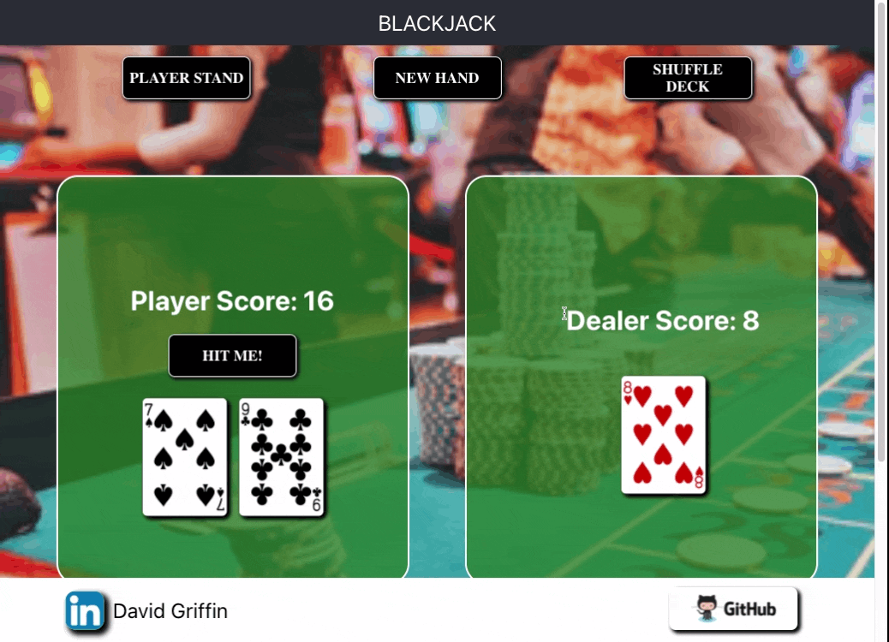

# [BLACKJACK - Vegas Rules](https://blackjack-vegas-dealer.herokuapp.com/)

## by [David Griffin](https://www.linkedin.com/in/david-griffin-117b0045/)
# Table of Contents:
- [Installation](https://github.com/davidleegriffin/Blackjack#Installation)
- [Navigation](https://github.com/davidleegriffin/Blackjack#Navigation)
- [Description](https://github.com/davidleegriffin/Blackjack#Description)
- [Next](https://github.com/davidleegriffin/Blackjack#Next)


# [Installation](https://github.com/davidleegriffin/Blackjack#Installation)

Clone the repo
```
git clone https://github.com/davidleegriffin/Blackjack.git
cd Blackjack
```

Install Dependencies
```
npm install
```

Run the App on Localhost:3000
```
npm start
```

# [Navigation](https://github.com/davidleegriffin/Blackjack#Navigation)



# [Description](https://github.com/davidleegriffin/Blackjack#Description)

Basic rules of blackjack with dealer standing on 17 or above. Shuffle Deck anytime or select New Hand to begin. Dealer receives one card face up and player then has the initiative until they Stand at which point the dealer will draw until it reaches a score of 17 or more or goes Bust. once the dealer busts or stands the result is displayed with the results being either player or dealer win or a push/tie. Once a result is declared, continue playing by clicking New Hand or Shuffle Deck.


# [Next](https://github.com/davidleegriffin/Blackjack#Next)

- Add Betting and Bank
- Fix Ace bug in scoring
- Fix async irregularities on dealing cards